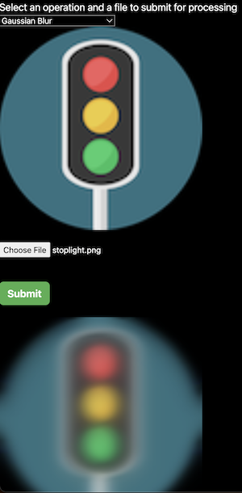

## imgtest

imgtest is a little scaffolding for trying out different image processing libraries on the backend

Currently just one operation (Gaussian blur) from the [jimp](https://github.com/jimp-dev/jimp) library is enabled. Spoiler alert: it'll look like this:



## Things used

- Express web framework
- [Joi](https://joi.dev/api/?v=17.9.1) schema validation on the endpoint
- [Supertest](https://github.com/ladjs/supertest) for full, live api response tests against express
- create-next-app for generating the frontend

## Try

This example code is [alive here](https://imgtest-387100.ew.r.appspot.com/jimp)

## Run locally

In `/back`:

```
npm install
npm test
npm start
```

In `/front`:

```
npm install
npm run dev
```

## Deploy (GCP)

Both the front and backend are ready to be deployed from their respective root directories with `gcloud app deploy`. Don't forget to change the target base URL for the API in the `uploader.tsx` component.
